# LNN (Liquid Neural Network) - Complete Flow Diagram

## Overall Architecture Flow

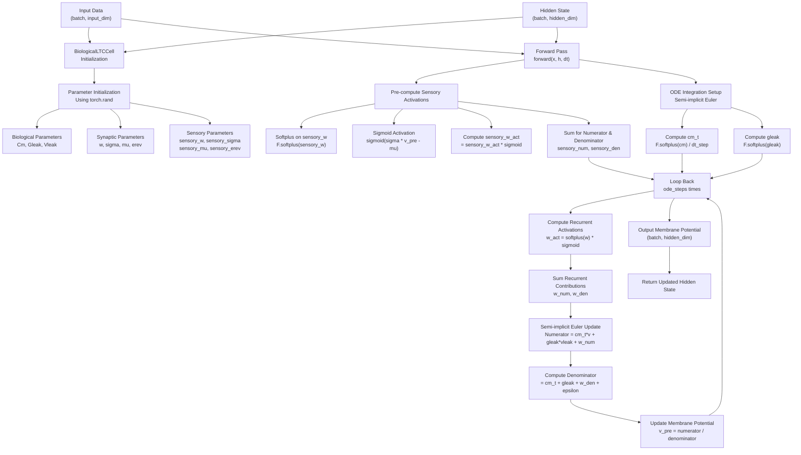

## Detailed Process Flow

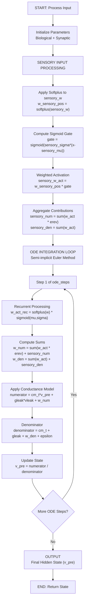

## Biological Conductance Model

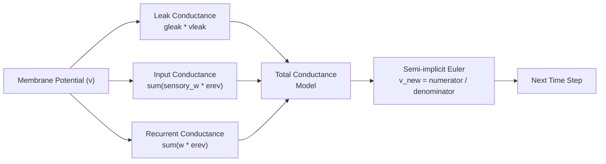

## Parameter Types and Purpose

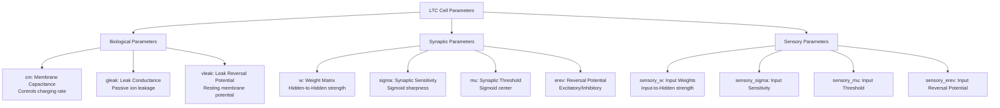

## Key Equations

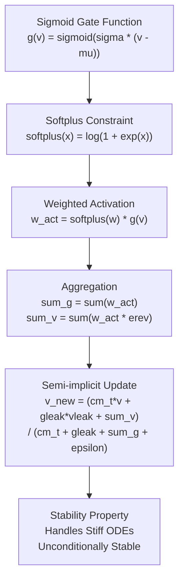

## Data Flow through Time Steps

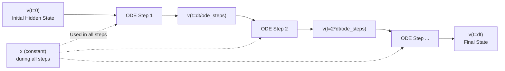

## Computational Complexity

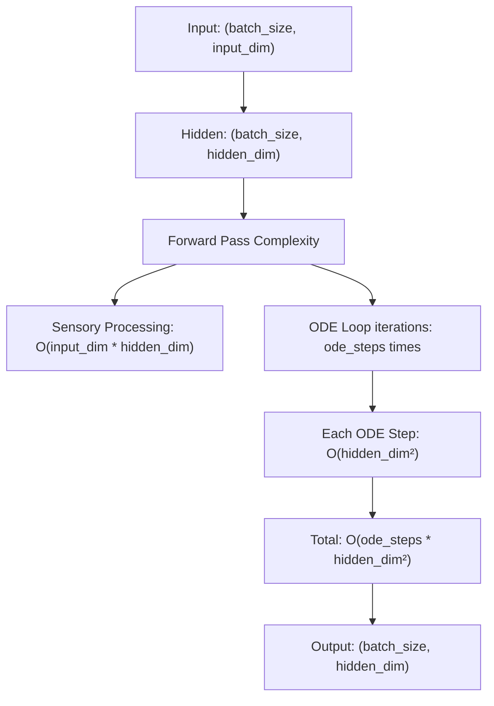

This diagram shows:
1. **Initialization** of biological parameters using random values
2. **Sensory processing** for input transformation
3. **ODE integration loop** with semi-implicit Euler method
4. **Conductance-based model** for membrane potential updates
5. **Parameter types** and their biological significance
6. **Time-stepping** through ODE integration
7. **Overall data flow** through the network

---

# Complete System Architecture - All Files Integration

## Project-Wide Data Flow

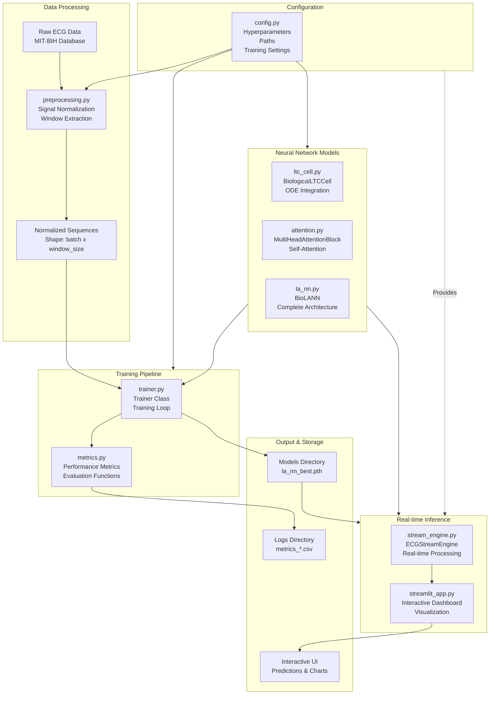

## Detailed File Interaction Diagram

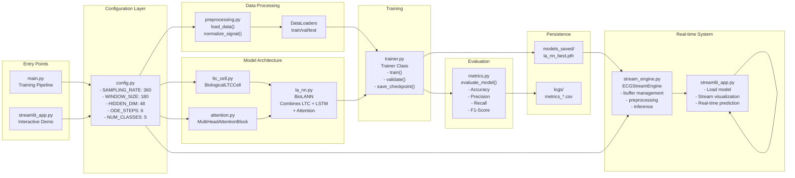

## Data Flow Through Training Pipeline

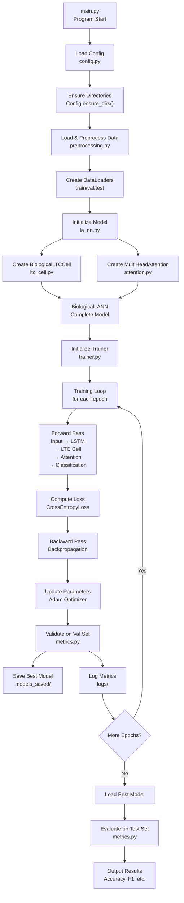

## Real-time Inference Data Flow

```mermaid
graph LR
    ECG["ECG Sensor<br/>Real-time Data"] --> STREAM["streamlit_app.py<br/>Streamlit Interface"]
    
    STREAM --> ENGINE["stream_engine.py<br/>ECGStreamEngine"]
    
    ENGINE --> BUFFER["Buffer Management<br/>Sliding Window<br/>WINDOW_SIZE=180"]
    
    BUFFER --> PREPROCESS["Preprocessing<br/>Normalization<br/>normalize_signal()"]
    
    PREPROCESS --> MODEL["Load BioLANN Model<br/>models_saved/la_nn_best.pth"]
    
    MODEL --> INFERENCE["Forward Pass<br/>Get Prediction"]
    
    INFERENCE --> POST["Post-processing<br/>softmax → class label<br/>confidence score"]
    
    POST --> VIZ["Visualization<br/>- ECG Plot<br/>- Class Probability<br/>- Arrhythmia Type<br/>- Timestamps"]
    
    VIZ --> DISPLAY["Display Results<br/>Streamlit UI"]
```

## Component Dependencies Map

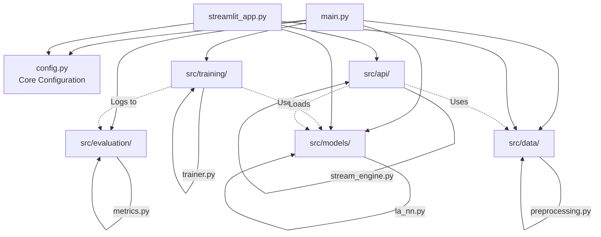

## Module Responsibilities

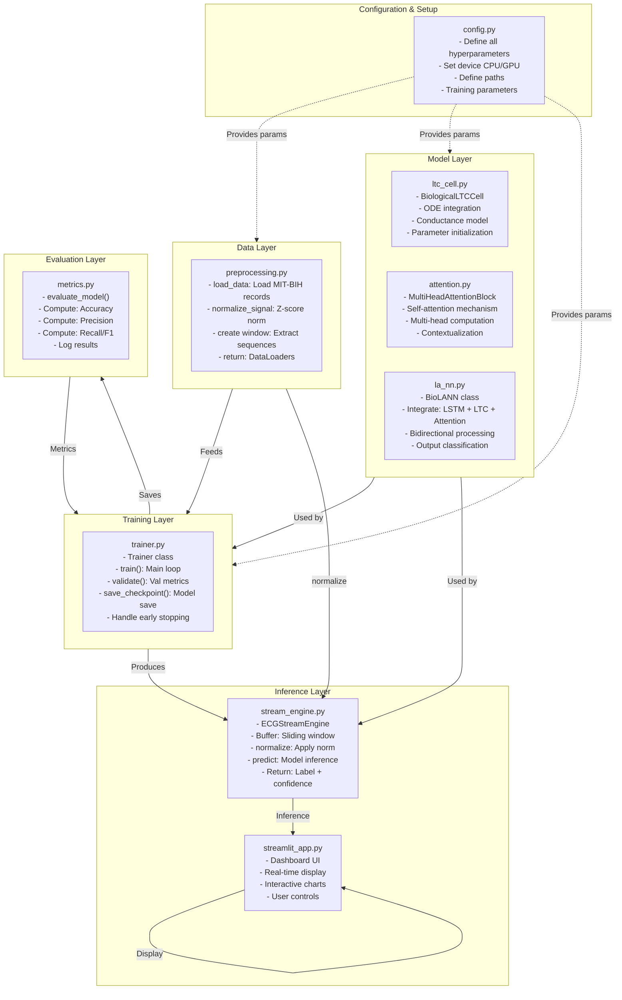

## File Interaction Summary

| File | Purpose | Inputs | Outputs | Key Functions |
|------|---------|--------|---------|---|
| **main.py** | Entry point for training | Config | Best model, Metrics | - Orchestrates pipeline |
| **config.py** | Global configuration | - | Hyperparameters | - SAMPLING_RATE, HIDDEN_DIM |
| **preprocessing.py** | Data loading & normalization | Raw ECG data | DataLoaders | load_data(), normalize_signal() |
| **ltc_cell.py** | Biological LTC cell | x, h | Updated hidden state | forward(), __init__() |
| **attention.py** | Multi-head attention | Input sequences | Attention output | forward() |
| **la_nn.py** | Complete model | Input tensor | Class logits | forward(), __init__() |
| **trainer.py** | Training orchestration | Model, DataLoaders | Trained model | train(), validate() |
| **metrics.py** | Evaluation metrics | Predictions, Labels | Metric scores | evaluate_model() |
| **stream_engine.py** | Real-time processing | Raw ECG stream | Predictions | buffer_input(), predict() |
| **streamlit_app.py** | Web UI dashboard | Model, Data | Visual dashboard | Page layouts, Charts |

This architecture ensures:
- **Modularity**: Each file has a clear responsibility
- **Reusability**: Components can be imported and used independently
- **Scalability**: Easy to add new features or modify existing ones
- **Maintainability**: Clear separation of concerns

---

# Individual Component Flow Diagrams

## 1. Attention Module Flow (attention.py)

### Positional Encoding Flow

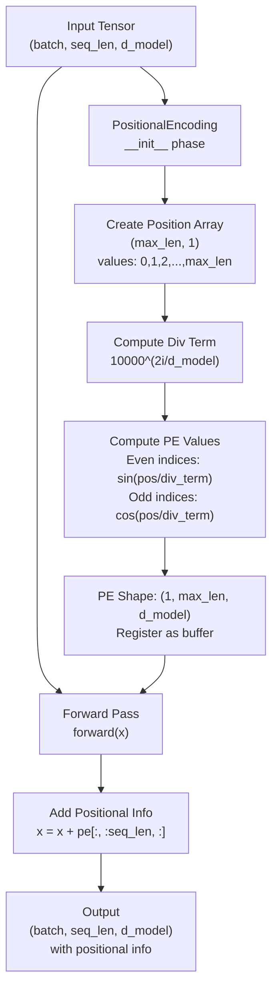

### Multi-Head Attention Block Flow

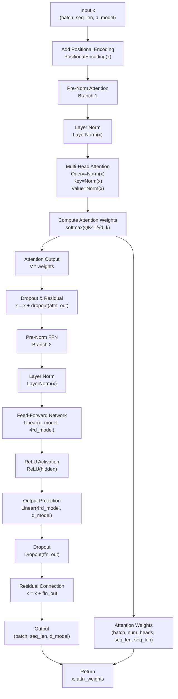

### Attention Computation Details

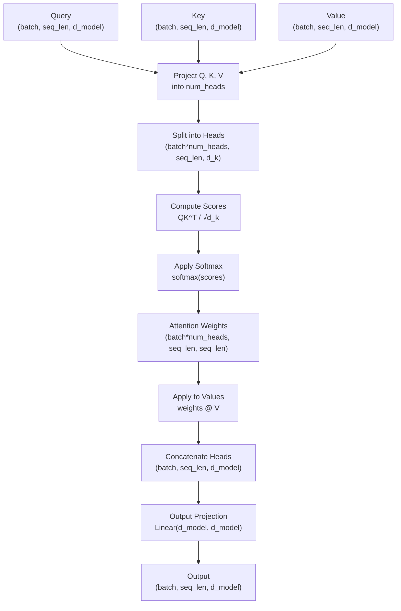

---

## 2. BioLANN Model Flow (la_nn.py)

### Complete BioLANN Forward Pass

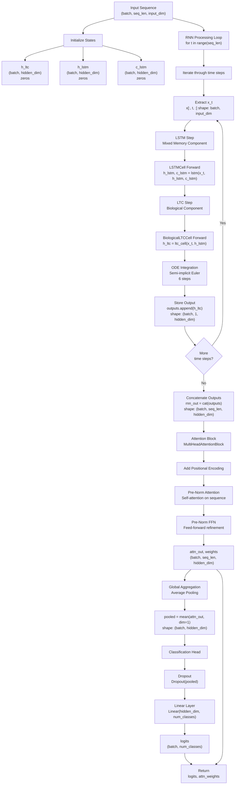

### Mixed Memory: LSTM + LTC Integration

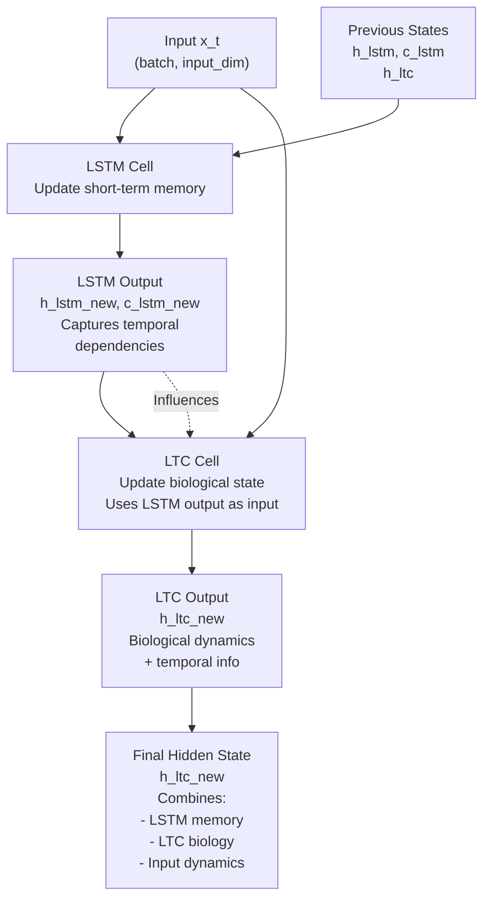

### Parameter Flow in BioLANN

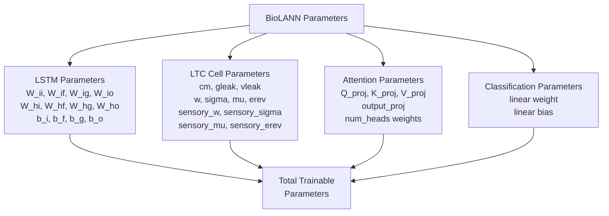

### Training Forward-Backward Flow

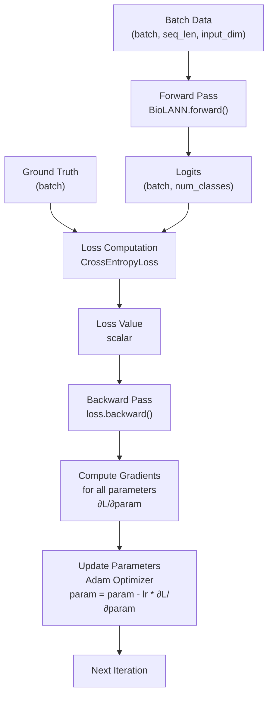

---

## 3. LTC Cell Flow (ltc_cell.py)

### Detailed LTC Computation Flow

```mermaid
graph TD
    INPUT["Input x<br/>(batch, input_dim)"] --> SENSORY["Sensory Processing<br/>Input → Hidden mapping"]
    HIDDEN["Hidden State h<br/>(batch, hidden_dim)"] --> SENSORY
    
    SENSORY --> S1["Apply Softplus<br/>sensory_w_pos = softplus(sensory_w)"]
    S1 --> S2["Compute Gate<br/>sigmoid(sensory_sigma*(x-sensory_mu))"]
    S2 --> S3["Weighted Activation<br/>sensory_w_act = w_pos * gate<br/>(batch, hidden_dim)"]
    
    S3 --> S4["Aggregate Input<br/>sensory_num = sum(w_act*erev, dim=1)"]
    S3 --> S5["Aggregate Conductance<br/>sensory_den = sum(w_act, dim=1)"]
    
    S4 --> SETUP["Setup ODE Parameters"]
    S5 --> SETUP
    
    SETUP --> ST1["cm_t = softplus(cm) / dt_step<br/>Scaled membrane capacitance"]
    SETUP --> ST2["gleak = softplus(gleak)<br/>Leak conductance"]
    SETUP --> ST3["vleak = vleak<br/>Leak potential"]
    
    ST1 --> ODE["ODE Integration Loop<br/>Semi-implicit Euler"]
    ST2 --> ODE
    ST3 --> ODE
    
    ODE --> ODE_ITER["For each ODE step (1 to 6)"]
    
    ODE_ITER --> REC["Recurrent Processing<br/>Hidden → Hidden"]
    REC --> REC1["w_act = softplus(w) * sigmoid(mu, sigma)<br/>(batch, hidden_dim, hidden_dim)"]
    REC1 --> REC2["w_num = sum(w_act*erev) + sensory_num"]
    REC2 --> REC3["w_den = sum(w_act) + sensory_den"]
    
    REC3 --> UPDATE["Semi-implicit Euler Update"]
    UPDATE --> NUM["numerator = cm_t*v_pre + gleak*vleak + w_num"]
    UPDATE --> DEN["denominator = cm_t + gleak + w_den + epsilon"]
    UPDATE --> NEW_V["v_pre_new = numerator / denominator<br/>(batch, hidden_dim)"]
    
    NEW_V --> CHECK{"All ODE steps<br/>complete?"}
    CHECK -->|No| ODE_ITER
    CHECK -->|Yes| OUTPUT["Output<br/>v_pre<br/>(batch, hidden_dim)"]
```

### Conductance Model Components

```mermaid
graph TD
    V["Membrane Potential<br/>v_pre"]
    
    V --> CM["Capacitive Current<br/>I_cap = C_m * dv/dt"]
    V --> GL["Leak Current<br/>I_leak = g_leak * (v - E_leak)"]
    V --> GS["Synaptic Current (Input)<br/>I_sensory = sum(g_s * (v - E_s))"]
    V --> GR["Synaptic Current (Recurrent)<br/>I_recurrent = sum(g_r * (v - E_r))"]
    
    CM --> EQ["Total Current Balance:<br/>I_cap + I_leak + I_sensory + I_recurrent = 0"]
    GL --> EQ
    GS --> EQ
    GR --> EQ
    
    EQ --> SOLVE["Rearrange for v_new:<br/>C_m*v + g_leak*E_leak<br/>+ sum(g_s*E_s) + sum(g_r*E_r)<br/>C_m + g_leak + sum(g_s) + sum(g_r)"]
    
    SOLVE --> FINAL["v_new = numerator / denominator"]
```

### Parameter Initialization Details

```mermaid
graph TD
    RAND["torch.rand(shape)<br/>Uniform [0, 1)"]
    
    RAND --> CM["cm = rand(hidden_dim) * 0.2 + 0.4<br/>Range: [0.4, 0.6]<br/>Membrane Capacitance"]
    RAND --> GL["gleak = rand(hidden_dim) * 0.1 + 0.01<br/>Range: [0.01, 0.11]<br/>Leak Conductance"]
    RAND --> VL["vleak = rand(hidden_dim) * 0.4 - 0.2<br/>Range: [-0.2, 0.2]<br/>Leak Potential"]
    
    RAND --> W["w = rand(hidden_dim, hidden_dim) * 0.1<br/>Range: [0, 0.1]<br/>Recurrent Weights"]
    RAND --> SIGMA["sigma = rand(hidden, hidden) * 5 + 3<br/>Range: [3, 8]<br/>Sensitivity"]
    RAND --> MU["mu = rand(hidden, hidden) * 0.5 + 0.3<br/>Range: [0.3, 0.8]<br/>Threshold"]
    RAND --> EREV["erev = rand(hidden, hidden) * 2 - 1<br/>Range: [-1, 1]<br/>Reversal Potential"]
    
    RAND --> SW["sensory_w = rand(input, hidden) * 0.1"]
    RAND --> SSIG["sensory_sigma = rand(input, hidden) * 5 + 3"]
    RAND --> SMU["sensory_mu = rand(input, hidden) * 0.5 + 0.3"]
    RAND --> SEREV["sensory_erev = rand(input, hidden) * 2 - 1"]
    
    CM --> PARAMS["Initialized Parameters<br/>Ready for training"]
    GL --> PARAMS
    VL --> PARAMS
    W --> PARAMS
    SIGMA --> PARAMS
    MU --> PARAMS
    EREV --> PARAMS
    SW --> PARAMS
    SSIG --> PARAMS
    SMU --> PARAMS
    SEREV --> PARAMS
```

### ODE Integration Stability

```mermaid
graph TD
    EXP["Explicit Euler<br/>v(t+Δt) = v(t) + Δt*f(v,t)"] --> PROB1["Stability Issues<br/>May diverge for<br/>stiff ODEs"]
    
    IMP["Implicit Euler<br/>v(t+Δt) = v(t) + Δt*f(v(t+Δt),t+Δt)"] --> PROB2["Expensive<br/>Requires iteration to solve"]
    
    SEMI["Semi-implicit Euler<br/>(Used in LTC)"] --> ADVAN["Advantages:"]
    
    ADVAN --> A1["✓ Unconditionally stable<br/>Works for stiff ODEs"]
    ADVAN --> A2["✓ Computationally efficient<br/>No iteration needed"]
    ADVAN --> A3["✓ Accurate dynamics<br/>Preserves biological properties"]
    ADVAN --> A4["✓ Handles multi-timescale<br/>processes"]
    
    A1 --> CHOICE["Semi-implicit Euler<br/>is CHOSEN for<br/>LTC Cell"]
    A2 --> CHOICE
    A3 --> CHOICE
    A4 --> CHOICE
```

### Sigmoid Activation in Synaptic Gates

```mermaid
graph TD
    V["Membrane Potential v"]
    MU["Threshold μ"]
    SIGMA["Sensitivity σ"]
    
    V --> COMPUTE["Compute: σ * (v - μ)"]
    MU --> COMPUTE
    SIGMA --> COMPUTE
    
    COMPUTE --> EXPONENT["e^(σ * (v - μ))"]
    
    EXPONENT --> SIGMOID["sigmoid = 1 / (1 + e^-(σ*(v-μ)))<br/>or<br/>sigmoid = e^(σ*(v-μ)) / (1 + e^(σ*(v-μ)))"]
    
    SIGMOID --> GATE["Synaptic Gate<br/>Range: [0, 1]"]
    
    GATE --> INTERP["Interpretation:<br/>- Gate ≈ 0: Synapse closed, no transmission<br/>- Gate ≈ 1: Synapse open, full transmission<br/>- Smooth transition around μ, controlled by σ"]
```

This complete breakdown shows:
1. **Attention**: How positional encoding and multi-head attention work
2. **BioLANN**: How LSTM and LTC integrate, then attention, then classification
3. **LTC**: The biological conductance model, ODE integration, and parameter initialization

