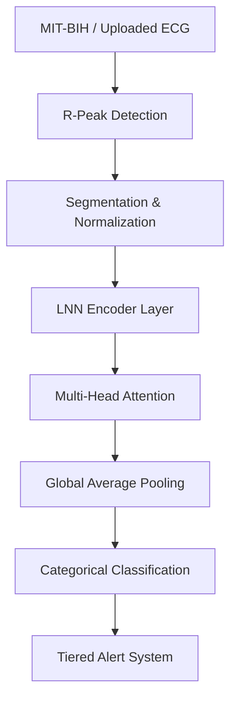

# LA-NN: Code Flow & Mathematical Architecture

This document provides a deep-dive into the technical execution and data progression within the **Liquid-Attention Neural Network (LA-NN)** project.

---

## 1. High-Level Data Pipeline
The system operates on three primary layers: **Data Ingestion**, **Neural Processing**, and **Clinical Decision Logic**.

---

## 2. Core Modules Flow

### A. Preprocessing (`src/data/preprocessing.py`)
1.  **Ingestion**: `wfdb` reads `.hea` and `.dat` files. 
2.  **Peak Extraction**: Annotations (`.atr`) or SciPy `find_peaks` locate the R-peak index.
3.  **Windowing**: A fixed 180-sample window is extracted (90 before, 90 after the peak).
4.  **Normalization**: Z-score normalization ensures zero mean and unit variance.
    *   `x' = (x - μ) / σ`

### B. LNN Encoder (`src/models/lnn.py`)
The segments enter the **Liquid Time-Constant (LTC)** network.
1.  **ODE Integration**: Each hidden state $h$ is updated via Euler integration over $N$ `ode_steps`.
2.  **Time-Continuity**: The model captures the "rhythm" of the beat, not just the shape, by modeling the derivative of the hidden state.
3.  **Output**: A sequence of temporal features.

### C. Attention Block (`src/models/attention.py`)
1.  **Positional Encoding**: Sinusoidal patterns are added to the temporal features to provide relative location context.
2.  **Self-Attention**: 
    *   $Attention(Q, K, V) = \text{softmax}(\frac{QK^T}{\sqrt{d_k}})V$
    *   This allows the model to identify specific parts of the ECG beat (e.g., P-wave or T-wave) that correlate with anomalies.
3.  **Feed-Forward Network (FFN)**: Refines the attended features through a non-linear mapping.

### D. Classification & Logic (`src/models/la_nn.py`, `src/evaluation/metrics.py`)
1.  **Global Pooling**: Compresses the temporal sequence into a single feature vector representing the beat.
2.  **Softmax Output**: Produces probabilities for 5 AAMI classes (N, S, V, F, Q).
3.  **Clinical Logic**:
    *   **Level 1 (Normal)**: $P(\text{Normal}) > 0.9$
    *   **Level 3 (Alarm)**: $P(\text{Ventricular}) > 0.4$ OR $P(\text{Fusion}) > 0.4$
    *   **Level 2 (Monitor)**: All other cases (e.g., high uncertainty).

---

## 3. Real-Time Inference Trace
When running `streamlit_app.py`, the flow is as follows:

1.  **`ECGStreamEngine`** (src/api/stream_engine.py) provides a sliding window of the live signal.
2.  Upon reaching an R-Peak index:
    *   `run_inference()` is triggered.
    *   A 180-sample segment is extracted from the buffer.
    *   Model runs on the background thread/async.
3.  **UI Update**:
    *   Confidence bars update in real-time.
    *   If **Alarm** is triggered, the trace color shifts to Red and the event is logged in the `anomalies` buffer.
4.  **Reporting**: On stop, the `anomalies` buffer is injected into a premium HTML template for diagnostic review.

---

## 4. Training Cycle Trace
1.  **`main.py`** initializes `Trainer`.
2.  **Class Weights**: Calculated from the training set to prevent "Model Bias" towards the Normal class (which typically makes up 90% of the data).
3.  **Optimizers**: `AdamW` with `Weight Decay` for architectural stability.
4.  **Logging**: Every epoch, metrics are stored in `logs/training_metrics.csv` for later visualization.

---
*Created for the M.Tech BITS Dissertation Demo*
