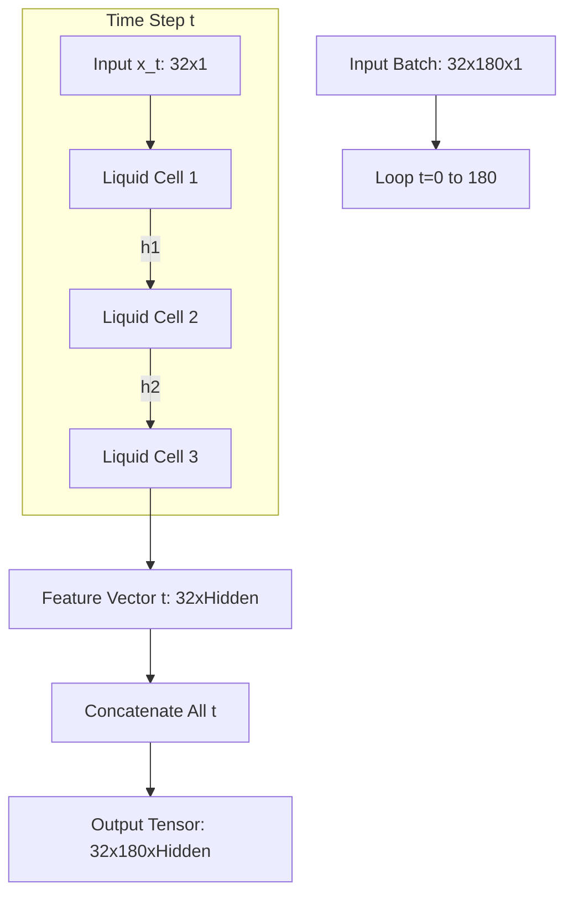

# 🧠 Deep Dive: Liquid Neural Network (LNN) Module

**File Location**: `src/models/lnn.py`

This document details the internal architecture, data flow, and mathematical operations of the Liquid Neural Network core, which serves as the **Time-Series Encoder** in the LA-NN project.

---

## 1. Class: `LiquidTimeConstantCell`
This is the fundamental unit of the network, analogous to an LSTM or GRU cell, but based on **Ordinary Differential Equations (ODEs)**.

### 📌 Role
To model the continuous-time dynamics of the input signal. Unlike standard RNNs which update properties in discrete jumps, this cell "flows" from state to state using a dynamic time-constant ($\tau$).

### ⚙️ Parameters (`__init__`)
| Parameter | Type | Description |
| :--- | :--- | :--- |
| `input_dim` | `int` | Dimensionality of the input input vector for a single time step (e.g., 1 for raw ECG). |
| `hidden_dim` | `int` | Size of the storage memory vector ($h$). |
| `ode_steps` | `int` | **Critical**: How many Euler integration steps to take *between* input samples (simulating continuous time). |
| `tau_min` | `float` | Minimum reaction speed (lower = faster reaction). |
| `tau_max` | `float` | Maximum reaction speed (higher = slower memory). |

### 📥 Inputs & 📤 Outputs (`forward`)
*   **Input**: 
    1.  `x`: Current time-step input features. Shape: `(batch_size, input_dim)`
    2.  `h_prev`: Previous hidden state. Shape: `(batch_size, hidden_dim)`
*   **Output**: 
    1.  `h_new`: Updated hidden state. Shape: `(batch_size, hidden_dim)`

### 🧮 Mathematical Logic (The "Liquid" Part)
Inside the `forward` pass, the cell loops `ode_steps` times. In each micro-step:

1.  **Compute Time Constant ($\tau$)**:
    *   The network decides *how fast* to change its state.
    *   $$ \tau = \tau_{min} + (\tau_{max} - \tau_{min}) \cdot \sigma(W_\tau x + U_\tau h + b) $$
    *   *Code Reference*: `compute_tau(x, h)`

2.  **Compute Target Equilibrium ($f(x,h)$)**:
    *   Where the state wants to go.
    *   $$ f = \tanh(W_f x + U_f h + b) $$
    *   *Code Reference*: `compute_f(x, h)`

3.  **ODE Solver Step (Euler Method)**:
    *   Update the state based on the differential equation.
    *   $$ h_{t+1} = h_t + \frac{-h_t + f}{\tau} \cdot dt $$
    *   *Code Reference*: `ode_step`

---

## 2. Class: `LNNEncoder`
This works as the wrapper that manages multiple layers of Liquid Cells and iterates over the time sequence.

### 📌 Role
To process the entire sequence of ECG data and produce a sequence of temporal features.

### ⚙️ Parameters (`__init__`)
| Parameter | Type | Description |
| :--- | :--- | :--- |
| `num_layers` | `int` | Number of stacked Liquid Cells (vertical depth). |
| `ode_steps`, `tau...` | - | Passed down to the Cells. |

### 📥 Inputs & 📤 Outputs (`forward`)
*   **Input**: 
    *   `x`: The entire ECG sequence. Shape: `(Batch_Size, Sequence_Length, Input_Dim)`
    *   Example: `(32, 180, 1)`
*   **Output**: 
    *   `tensor`: Sequence of features. Shape: `(Batch_Size, Sequence_Length, Hidden_Dim)`
    *   Example: `(32, 180, 32)` assuming `hidden_dim=32`.

### 🌊 Flow Logic
The encoder performs a **Double Loop**:

1.  **Outer Loop (Time)**: Iterates `t` from 0 to 180.
    *   Extracts `x_t` (Input at time t).
2.  **Inner Loop (Depth)**: Iterates through stacked layers.
    *   Layer 1 takes `x_t`.
    *   Layer 2 takes output of Layer 1.
    *   Layer 3 takes output of Layer 2.
3.  **Collection**: The final output of the top layer at time `t` is stored.

## 📊 Visual Data Flow



## 🔑 Key Takeaways for Defense
1.  **Why is it "Liquid"?** Because `tau` changes for every single input sample. The system's "viscosity" (responsiveness) adapts to the signal.
2.  **Why `ode_steps`?** This simulates continuous time. Even though our data is discrete (360Hz), the math assumes a continuous biological process.
3.  **Parameter Count**: 
    *   Each cell has 4 Linear layers (`tau_input`, `tau_hidden`, `f_input`, `f_hidden`).
    *   This is heavier than a standard RNN cell but captures much richer dynamics.

---

## 3. Detailed Layer Breakdown: "Inside the Cell"

To "add the work," let's look at exactly what the code defines in `__init__` and what each part does.

```python
# 1. Factors affecting the Speed (Tau)
self.linear_tau_input = nn.Linear(input_dim, hidden_dim)
self.linear_tau_hidden = nn.Linear(hidden_dim, hidden_dim)

# 2. Factors affecting the Target State (f)
self.linear_f_input = nn.Linear(input_dim, hidden_dim)
self.linear_f_hidden = nn.Linear(hidden_dim, hidden_dim)
```

### 🔹 Layer Group 1: The "Valve" Controls (`linear_tau_...`)
These layers decide the **Speed of Flow**.
*   **`linear_tau_input`**: Checks the incoming signal. Is it a sharp spike (R-peak)? If so, it might signal "Open the valve, react fast!"
*   **`linear_tau_hidden`**: Checks the internal state. Is the memory already saturated? It might signal "Slow down updates."
*   **Result**: They combine to produce $\tau$ (Tau), which is essentially the **denominator** in the differential equation. A small denominator = Large derivative = Fast change.

### 🔹 Layer Group 2: The "Target" Drivers (`linear_f_...`)
These layers decide the **Direction of Flow**.
*   **`linear_f_input`**: Maps the raw ECG voltage (e.g., 0.5mV) into the high-dimensional hidden space.
*   **`linear_f_hidden`**: This is the **Recurrent Connection**. It carries the memory from the previous millisecond to the current one.
*   **Result**: They combine to produce $f(x,h)$, which is the equilibrium point the system tries to reach.

---

## 4. Integration: How is this output used in the Project?

The `LNNEncoder` is just the **first step** of the 3-stage pipeline in `src/models/la_nn.py`.

### The Output
*   **What is it?** A tensor of shape `(Batch, 180, Hidden_Dim)`.
*   **Meaning**: It is no longer a raw signal. It is a **"Liquid Feature Sequence"**.
    *   Time Step 0 might contain: `[Values representing start of P-wave, Slow adaptation speed]`
    *   Time Step 85 might contain: `[Values representing R-peak tip, Fast adaptation speed]`

### Next Destination: The Attention Block
This output is passed directly to `MultiHeadAttentionBlock`.

```python
# From src/models/la_nn.py

# Step 1: Liquid Encoding
lnn_out = self.lnn_encoder(x) 
# Output: A sequence where every point knows its local temporal dynamics (speed/change).

# Step 2: Attention
attn_out, attn_weights = self.attention_block(lnn_out)
# Output: A sequence where every point has checked with every OTHER point.
```

### 🚀 Why this connection matters?
1.  **LNN** understands **Order & Speed** (Local context).
    *   *Analogy*: Reading a sentence letter-by-letter and understanding the syllables.
2.  **Attention** understands **Global Context**.
    *   *Analogy*: Reading the whole sentence again to understand the meaning or grammar.

**Final Decision**:
The classifier eventually looks at this "Liquid + Attended" data. It uses the work done by the LNN to distinguish, for example, a **Fusion Beat** (which has weird timing) from a **Normal Beat** (standard timing). The LNN is the specific component that catches the "weird timing."
